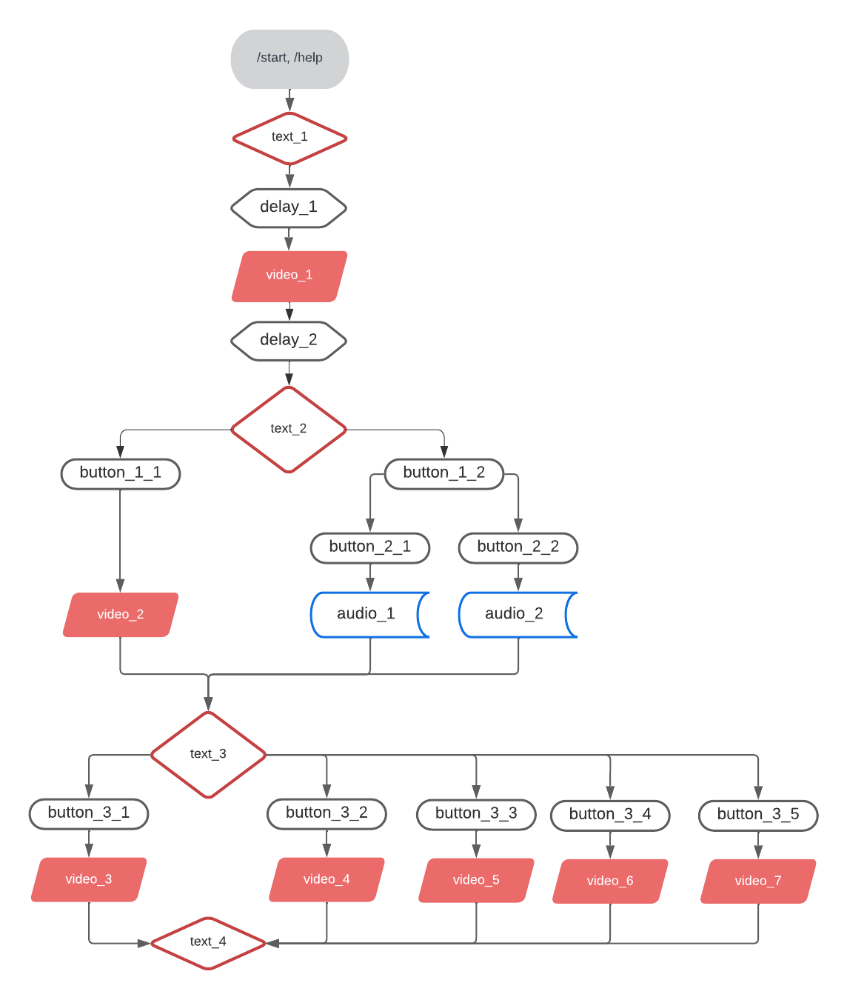

# Телеграмм бот

## **Редактируются данные только с 12 по 43 строку!!!**

Начало работы: команда `/start`

Аудио файлы загружаются в папку `audio_dir`  
Аудио файлы должны быть в формате .MP3 или .M4A

Видео файлы загружаются в папку `video_dir`  
Видео файлы должны быть в формате MPEG4
---
**Есть возможность отправки файлов по URL (без сохранения файлов в папке) - для этого нужно править код.**  
***Но если ссылка станет недоступной, то бот упадёт в ошибку.***

---

### Наименование файлов

Варианты:

1) /audio_dir/audio_1.mp3  
   audio_1 = "audio_1.mp3"
2) /audio_dir/мой_аудио_файл.mp3  
   Тогда
   audio_1 = "мой_аудио_файл.mp3"

## Структура логики бота

